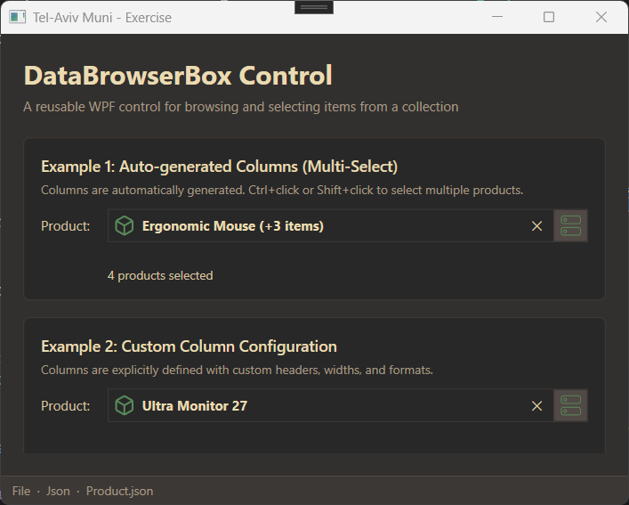
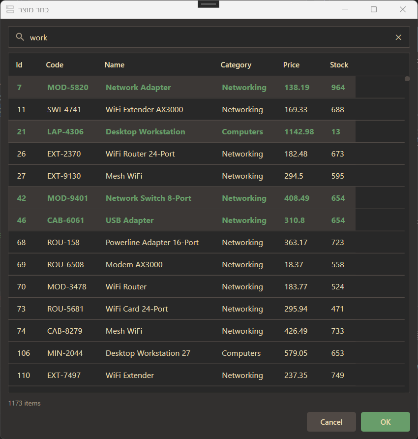

# User Guide

## What This Application Does

The application displays a product catalog and lets you browse, search, and select products using a reusable `DataBrowserBox` control. It supports single-item and multi-item selection, real-time filtering, and keyboard navigation.

## Features

### DataBrowserBox Control

A drop-in WPF control that shows the currently selected item(s) alongside a browse button. Clicking the button opens a search dialog.

- **Single-select mode** — select one item; the control displays its name
- **Multi-select mode** — select multiple items; the control displays a count with a × clear button
- **Watermark** — shows _"Click to select..."_ in italic when nothing is selected
- **Custom columns** — configure which columns to show, with custom headers (including Hebrew/RTL), widths, number/currency formats, and alignment



### Browse Dialog

| Feature | Behavior |
|---------|----------|
| Search | Type anywhere to filter rows in real time (case-insensitive, searches all columns) |
| Clear filter | × button appears when search text is present; click to clear |
| Item counter | Shows the number of currently visible items |
| Selection highlight | Selected row has a blue background and bold text |
| Scroll to selection | Previously selected item is automatically scrolled into view when the dialog opens |
| Resizable | Drag dialog borders to resize |



### Keyboard Shortcuts

| Key | Action |
|-----|--------|
| Any character | Focus search box and start filtering |
| `Enter` (in grid) | Confirm selection and close |
| `Escape` (in search box) | Clear filter text |
| `Escape` (elsewhere) | Cancel and close dialog |

### Themes

The application ships with four themes selectable in `App.xaml`:
- **Blue** (default light theme)
- **Emerald** (green light theme)
- **GruvboxDark** (dark theme, morhetz/gruvbox palette)
- **AyuDark** (dark theme, Zed editor Ayu palette)

## Using the DataBrowserBox Control

### Basic Usage (auto-generated columns)

```xaml
<controls:DataBrowserBox
    Height="30"
    ItemsSource="{Binding Products}"
    SelectedItem="{Binding SelectedProduct, Mode=TwoWay}"
    DisplayMemberPath="Name"
    DialogTitle="Select Product"
    DialogService="{StaticResource DialogService}" />
```

### Multi-Select Mode

```xaml
<controls:DataBrowserBox
    Height="30"
    ItemsSource="{Binding Products}"
    SelectedItems="{Binding SelectedProducts, Mode=TwoWay}"
    AllowMultipleSelection="True"
    DisplayMemberPath="Name"
    DialogTitle="Select Products"
    DialogService="{StaticResource DialogService}" />
```

### Custom Columns

```xaml
<controls:DataBrowserBox
    Height="30"
    ItemsSource="{Binding Products}"
    SelectedItem="{Binding SelectedProduct, Mode=TwoWay}"
    DisplayMemberPath="Name"
    DialogTitle="Select Product"
    DialogService="{StaticResource DialogService}">
    <controls:DataBrowserBox.Columns>
        <local:BrowserColumn DataField="Name"     Header="שם מוצר"  Width="200" />
        <local:BrowserColumn DataField="Price"    Header="מחיר"     Width="100" Format="C2" HorizontalAlignment="Right" />
        <local:BrowserColumn DataField="Category" Header="קטגוריה"  Width="150" />
        <local:BrowserColumn DataField="Code"     Header="קוד"      Width="120" />
    </controls:DataBrowserBox.Columns>
</controls:DataBrowserBox>
```

### Properties

| Property | Type | Description |
|----------|------|-------------|
| `ItemsSource` | `IEnumerable` | Collection of items to browse |
| `SelectedItem` | `object` | Currently selected item (single-select) |
| `SelectedItems` | `IList` | Currently selected items (multi-select) |
| `AllowMultipleSelection` | `bool` | Enable multi-item selection (default: `false`) |
| `DisplayMemberPath` | `string` | Property name shown in the control after selection |
| `DialogTitle` | `string` | Title bar text for the browse dialog |
| `DialogService` | `IDialogService` | Service that creates and shows the dialog |
| `Columns` | `IList<BrowserColumn>` | Custom column definitions (auto-generated if omitted) |

### BrowserColumn Properties

| Property | Description |
|----------|-------------|
| `DataField` | Property name to bind (e.g. `"Price"`) |
| `Header` | Column header text (supports Hebrew and other languages) |
| `Width` | Column width in pixels |
| `Format` | String format, e.g. `"C2"` for currency, `"N0"` for integers, `"d"` for short date |
| `HorizontalAlignment` | `"Left"`, `"Right"`, or `"Center"` |

## Data Format

The application reads product data from the configured storage provider. The default JSON file (`Data/Product.json`) uses this structure:

```json
[
  {
    "Id": 1,
    "Code": "LAP-001",
    "Name": "Laptop Pro 15",
    "Category": "Computers",
    "Price": 1299.99
  }
]
```

## Error Messages

| Situation | What happens |
|-----------|-------------|
| Data file not found | Silent fallback — empty list is shown |
| Invalid JSON / parse error | Message box describes the problem |
| Empty collection on Browse click | Message box asks the user to load data first |
| Database connection failure | Error message with connection details |

## Switching Storage Providers

Open `TelAvivMuni-Exercise/appsettings.json` and change the `Storage` section:

```json
{ "Storage": { "Kind": "File", "Provider": "Json" } }
```

Available values: `Kind` = `"File"` or `"Database"`; `Provider` = `"Json"`, `"Xml"`, `"Csv"`, `"SqlServer"`, `"Sqlite"`, `"PostgreSQL"`, `"MySql"`.

See [SETUP_GUIDE.md](SETUP_GUIDE.md) for full configuration details.
